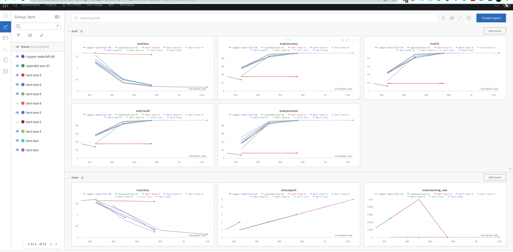
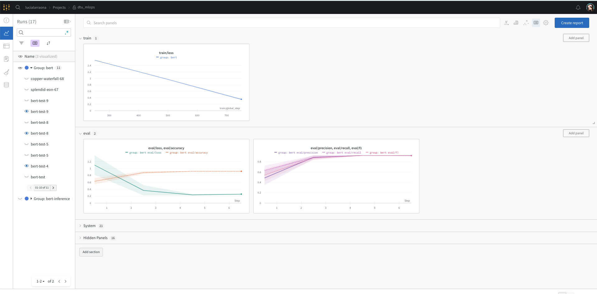
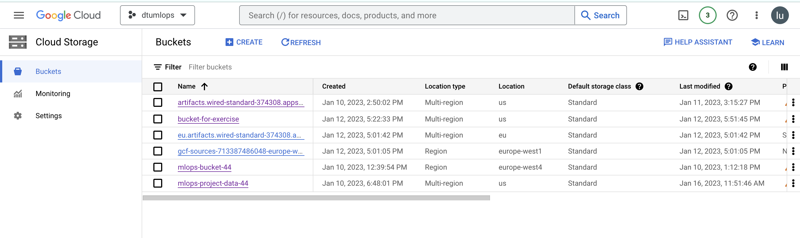
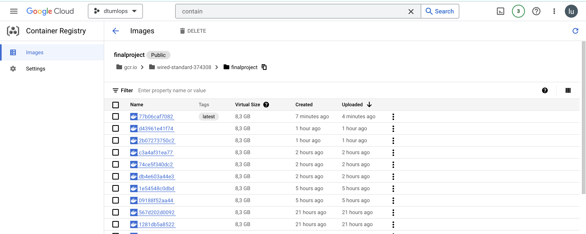

# Exam template for 02476 Machine Learning Operations

This is the report template for the exam. Please only remove the text formatted as with three dashes in front and behind
like:

```--- question 1 fill here ---```

where you instead should add your answers. Any other changes may have unwanted consequences when your report is auto
generated in the end of the course. For questions where you are asked to include images, start by adding the image to
the `figures` subfolder (please only use `.png`, `.jpg` or `.jpeg`) and then add the following code in your answer:

```markdown

```

In addition to this markdown file, we also provide the `report.py` script that provides two utility functions:

Running:

```bash
python report.py html
```

will generate an `.html` page of your report. After deadline for answering this template, we will autoscrape
everything in this `reports` folder and then use this utility to generate an `.html` page that will be your serve
as your final handin.

Running

```bash
python report.py check
```

will check your answers in this template against the constrains listed for each question e.g. is your answer too
short, too long, have you included an image when asked to.

For both functions to work it is important that you do not rename anything. The script have two dependencies that can
be installed with `pip install click markdown`.

## Overall project checklist

The checklist is *exhaustic* which means that it includes everything that you could possible do on the project in
relation the curricilum in this course. Therefore, we do not expect at all that you have checked of all boxes at the
end of the project.

### Week 1

* [ ] Create a git repository
* [ ] Make sure that all team members have write access to the github repository
* [ ] Create a dedicated environment for you project to keep track of your packages
* [ ] Create the initial file structure using cookiecutter
* [ ] Fill out the `make_dataset.py` file such that it downloads whatever data you need and
* [ ] Add a model file and a training script and get that running
* [ ] Remember to fill out the `requirements.txt` file with whatever dependencies that you are using
* [ ] Remember to comply with good coding practices (`pep8`) while doing the project
* [ ] Do a bit of code typing and remember to document essential parts of your code
* [ ] Setup version control for your data or part of your data
* [ ] Construct one or multiple docker files for your code
* [ ] Build the docker files locally and make sure they work as intended
* [ ] Write one or multiple configurations files for your experiments
* [ ] Used Hydra to load the configurations and manage your hyperparameters
* [ ] When you have something that works somewhat, remember at some point to to some profiling and see if
      you can optimize your code
* [ ] Use Weights & Biases to log training progress and other important metrics/artifacts in your code. Additionally,
      consider running a hyperparameter optimization sweep.
* [ ] Use Pytorch-lightning (if applicable) to reduce the amount of boilerplate in your code

### Week 2

* [ ] Write unit tests related to the data part of your code
* [ ] Write unit tests related to model construction and or model training
* [ ] Calculate the coverage.
* [ ] Get some continuous integration running on the github repository
* [ ] Create a data storage in GCP Bucket for you data and preferable link this with your data version control setup
* [ ] Create a trigger workflow for automatically building your docker images
* [ ] Get your model training in GCP using either the Engine or Vertex AI
* [ ] Create a FastAPI application that can do inference using your model
* [ ] If applicable, consider deploying the model locally using torchserve
* [ ] Deploy your model in GCP using either Functions or Run as the backend

### Week 3

* [ ] Check how robust your model is towards data drifting
* [ ] Setup monitoring for the system telemetry of your deployed model
* [ ] Setup monitoring for the performance of your deployed model
* [ ] If applicable, play around with distributed data loading
* [ ] If applicable, play around with distributed model training
* [ ] Play around with quantization, compilation and pruning for you trained models to increase inference speed

### Additional

* [ ] Revisit your initial project description. Did the project turn out as you wanted?
* [ ] Make sure all group members have a understanding about all parts of the project
* [ ] Uploaded all your code to github

## Group information

### Question 1
> **Enter the group number you signed up on <learn.inside.dtu.dk>**
>
> Answer:

44

### Question 2
> **Enter the study number for each member in the group**
>
> Example:
>
> *sXXXXXX, sXXXXXX*
>
> Answer:

s220492, s220351, s220243

### Question 3
> **What framework did you choose to work with and did it help you complete the project?**
>
> Answer length: 100-200 words.
>
> Example:
> *We used the third-party framework ... in our project. We used functionality ... and functionality ... from the*
> *package to do ... and ... in our project*.
>
> Answer:

 We used the Transformers framework in Pytorch in our project. We used pretrained Bert tokenizer and Bert model for classification, which we fine-tuned for the project task. For training the model we used the *trainer* function from HuggingFace, dedicated for transformes.

## Coding environment

> In the following section we are interested in learning more about you local development environment.

### Question 4

> **Explain how you managed dependencies in your project? Explain the process a new team member would have to go**
> **through to get an exact copy of your environment.**
>
> Answer length: 100-200 words
>
> Example:
> *We used ... for managing our dependencies. The list of dependencies was auto-generated using ... . To get a*
> *complete copy of our development enviroment, one would have to run the following commands*
>
> Answer:

To automatically create and maintain the requirements.txt file, which contains information about all of the project dependencies, we used the *pipreqs* package. The file created this way contains only packages used in the current project, not all of the packages installed in the environment.  We were also developing our code in a separate conda environment, therefore we could get the list of dependencies by using `pip freeze` command. The file with requirements has to be updated after every created change, to ensure that it contains up-to-date dependencies. 

 Our development environment is copied when running `pip install requirements.txt` command. It's recommended to first create new python environment (e.g. with conda create --name my_env), and install dependencies afterwards.


### Question 5

> **We expect that you initialized your project using the cookiecutter template. Explain the overall structure of your**
> **code. Did you fill out every folder or only a subset?**
>
> Answer length: 100-200 words
>
> Example:
> *From the cookiecutter template we have filled out the ... , ... and ... folder. We have removed the ... folder*
> *because we did not use any ... in our project. We have added an ... folder that contains ... for running our*
> *experiments.*
> Answer: 

The overall structure of our project can be seen at the bottom of our readme file in the repository. From the cookiecutter template we have filled out the src/models, src/data, data, models, docs folder. Inside de src/ folder we have added a config folder which contains all .yaml files for our experiments. We have removed the notebooks and references folders because we did not created notebooks in our project. We have added a test folder that contains test scripts of our model to be sincronized with github actions, and an app folder with scripts for deployment of our app with FastAPI. The reports folder which contains this report and the figures folder inside with all pictures.

### Question 6

> **Did you implement any rules for code quality and format? Additionally, explain with your own words why these**
> **concepts matters in larger projects.**
>
> Answer length: 50-100 words.
>
> Answer:

DID WE? SHOULD WE? In our scripts, we used informative comments, to make our code clear and easier to understand. 

In large project code is usually developed by many different people, rules for code quality and format are helping to keep it coherent, in order to make it more clear and easy to understand.

## Version control

> In the following section we are interested in how version control was used in your project during development to
> corporate and increase the quality of your code.

### Question 7

> **How many tests did you implement and what are they testing in your code?**
>
> Answer length: 50-100 words.
>
> Example:
> *In total we have implemented X tests. Primarily we are testing ... and ... as these the most critical parts of our*
> *application but also ... .*
>
> Answer:

--- question 7 fill here ---

### Question 8

> **What is the total code coverage (in percentage) of your code? If you code had an code coverage of 100% (or close**
> **to), would you still trust it to be error free? Explain you reasoning.**
>
> Answer length: 100-200 words.
>
> Example:
> *The total code coverage of code is X%, which includes all our source code. We are far from 100% coverage of our **
> *code and even if we were then...*
>
> Answer:

--- question 8 fill here ---

### Question 9

> **Did you workflow include using branches and pull requests? If yes, explain how. If not, explain how branches and**
> **pull request can help improve version control.**
>
> Answer length: 100-200 words.
>
> Example:
> *We made use of both branches and PRs in our project. In our group, each member had an branch that they worked on in*
> *addition to the main branch. To merge code we ...*
>
> Answer:

Since it was only three of us, and we designed separated tasks that included changing complete different files along the project, we didn't use branching because we didn't crash each other's work. However, in the case we were to change someone elses file, then we agreed to add a new branch to revise before merging. 
Branches and pull requests can improve version control since they are designed to work independently of the main project branch and makes it easy to separate and clearly define different tasks for different contributors on the same script. 

### Question 10

> **Did you use DVC for managing data in your project? If yes, then how did it improve your project to have version**
> **control of your data. If no, explain a case where it would be beneficial to have version control of your data.**
>
> Answer length: 100-200 words.
>
> Example:
> *We did make use of DVC in the following way: ... . In the end it helped us in ... for controlling ... part of our*
> *pipeline*
>
> Answer:

We did make use of DVC in the following way: We introduced our newly downloaded kaggle dataset as raw data, and then created a make_dataset.py script that would turn the raw text into tokenized and saved it in the processed data folder. We then created a remote storage bucket in the cloud and added the link to it with `dvc add -d remote gs://mlops-bucket-project-data-44` finally we pushed the data to the bucket using `dvc push` which enables all users  to download the data from the bucket using `dvc pull`
To keep track of the data versions (in this project only minor fixes, but on the long run a big upgrade) we added tags to our commits specifying the data version as v1.01 and so on. It helped us a lot since we no longer had to store the data in the github repo and everyone had access to the latest versions. 
### Question 11

> **Discuss you continues integration setup. What kind of CI are you running (unittesting, linting, etc.)? Do you test**
> **multiple operating systems, python version etc. Do you make use of caching? Feel free to insert a link to one of**
> **your github actions workflow.**
>
> Answer length: 200-300 words.
>
> Example:
> *We have organized our CI into 3 separate files: one for doing ..., one for running ... testing and one for running*
> *... . In particular for our ..., we used ... .An example of a triggered workflow can be seen here: <weblink>*
>
> Answer:

--- question 11 fill here ---

## Running code and tracking experiments

> In the following section we are interested in learning more about the experimental setup for running your code and
> especially the reproducibility of your experiments.

### Question 12

> **How did you configure experiments? Did you make use of config files? Explain with coding examples of how you would**
> **run a experiment.**
>
> Answer length: 50-100 words.
>
> Example:
> *We used a simple argparser, that worked in the following way: python my_script.py --lr 1e-3 --batch_size 25*
>
> Answer:

We used Hydra and different config files. To integrate it we added the decorator before our main function in train_mmodel.py and we referenced a default config file in the hydra decorator. To access the different values we replaced them inside the funcion by callign config.PARAMETER_NAME. With this setup it is possible to change the different hyperparemters from the command line adding the corresponding arguments as follows:

`python train_model.py train.lr= 0.01 train.epochs=2`

### Question 13

> **Reproducibility of experiments are important. Related to the last question, how did you secure that no information**
> **is lost when running experiments and that your experiments are reproducible?**
>
> Answer length: 100-200 words.
>
> Example:
> *We made use of config files. Whenever an experiment is run the following happens: ... . To reproduce an experiment*
> *one would have to do ...*
>
> Answer:

We made use of config files. When an experiment runs, the hyperparameters that have been called are stored in the config file designed for the experiment. We also created a hierarchy where the default_config.yaml would reference the other experiment config files and so on (see it below). In case of overriding some of the hyperparameters on the command line we ensure there is no information loss by tracking the experiment also with WandB. This API helps as save the hyperparameters used for every run, among other metrics. To reproduce an experiment one would only have to choose the appropiate .yaml file and reference it with the hydra decorator: `@hydra.main(config_path="../config", config_name="CHOSEN_EXPERIMENT_TO_REPRODUCE.yaml")` 

    ├── config
    │ ├── default_config.yaml        <- references the other config
    │   ├── train                    <- folder for training config files
    │   │   ├── train_config.yaml    
    │   ├── exp1                     <- folder for experiment1 config files
    │   │   └── exp1_config.yaml    
    │


### Question 14

> **Upload 1 to 3 screenshots that show the experiments that you have done in W&B (or another experiment tracking**
> **service of your choice). This may include loss graphs, logged images, hyperparameter sweeps etc. You can take**
> **inspiration from [this figure](figures/wandb.png). Explain what metrics you are tracking and why they are**
> **important.**
>
> Answer length: 200-300 words + 1 to 3 screenshots.
>
> Example:
> *As seen in the first image when have tracked ... and ... which both inform us about ... in our experiments.*
> *As seen in the second image we are also tracking ... and ...*
>
> Answer:

As seen in the first picture, and given our project aimed for a multiclass classification, we have tracked accuracy, precision, f1, and recall for evaluation and loss and learning rate for training. Wandb also includes some system metrics, which are useful to also explore the hardware performance during the experiment. 
All of our runs in this case are grouped under the name 'bert' given the possibility to add different experiments with other transformers and then, as seen in figure 2, we can track groups of experiments in parallel with the same metrics.
We considered the possibility of adding sweeps, however, we found a good combination of hyperparameters after only 10 experiments and we discarded it for this project. The procedure would have been the following: create a config file but  with a dictionary of values for each hyperparamenter to try, and then start the agent so that it created random combinations of them for each run.



### Question 15

> **Docker is an important tool for creating containerized applications. Explain how you used docker in your**
> **experiments? Include how you would run your docker images and include a link to one of your docker files.**
>
> Answer length: 100-200 words.
>
> Example:
> *For our project we developed several images: one for training, inference and deployment. For example to run the*
> *training docker image: `docker run trainer:latest lr=1e-3 batch_size=64`. Link to docker file: <weblink>*
>
> Answer:

For our project we decided to create one docker image for training. The image buildin is automated with Cloud build so that everytime we push code to the main branch of the project repository it builds a new image with a :latest tag. To run our image the user would first need a machine with GPU, then would need to pull the image doing `sudo docker pull gcr.io/wired-standard-374308/finalproject:latest` and finally, run the image by using `sudo docker run gcr.io/wired-standard-374308/finalproject:latest`. The link to the docker file is <https://github.com/lucialarraona/dtu_mlops23_project/blob/main/Dockerfile>

### Question 16

> **When running into bugs while trying to run your experiments, how did you perform debugging? Additionally, did you**
> **try to profile your code or do you think it is already perfect?**
>
> Answer length: 100-200 words.
>
> Example:
> *Debugging method was dependent on group member. Some just used ... and others used ... . We did a single profiling*
> *run of our main code at some point that showed ...*
>
> Answer:

In order to perform debugging, we decided it would be an individual task given the part of the code you where in charge of. In the case of building the model itself a lot of debugging was done for tokenizing etc. We created different stop points and explored the variables. While building the docker images, we tried to print the structure of the archives by running ´ls -a´ in the image in order to find bugs. 
The code isn't perferct, however we made sure we used the training/evaluation functions for the transformers given by HuggingFace since they are built on top of pytorch and ensure the most optimized performance for this large models. We didn't do profiling.

## Working in the cloud

> In the following section we would like to know more about your experience when developing in the cloud.

### Question 17

> **List all the GCP services that you made use of in your project and shortly explain what each service does?**
>
> Answer length: 50-200 words.
>
> Example:
> *We used the following two services: Engine and Bucket. Engine is used for... and Bucket is used for...*
>
> Answer:

We used the following services: Engine, Bucket, Cloud Build, Container registry and Cloud Functions. Engine is used to create Virtual Machine instances from which we can work as our own computer with more powerful hardware. Bucket is a remote storage space. Cloud build is used to build the docker images of our projects, and when the build is succesful they are stored in the Container registry, which is just a storage space in the cloud specifically defined for storing docker images.

### Question 18

> **The backbone of GCP is the Compute engine. Explained how you made use of this service and what type of VMs**
> **you used?**
>
> Answer length: 100-200 words.
>
> Example:
> *We used the compute engine to run our ... . We used instances with the following hardware: ... and we started the*
> *using a custom container: ...*
>
> Answer:

For our project we created an instance with an attached GPU to be able to run our model training (the BERT transformer is a very large model). The hardware used in said VM-instance is and NVIDIA-T4 GPU and 200 GB of disk memory. For our model run we tried two different approaches: directly copying the repository and running the script, and by pulling an image from our Container Registry. 

### Question 19

> **Insert 1-2 images of your GCP bucket, such that we can see what data you have stored in it.**
> **You can take inspiration from [this figure](figures/bucket.png).**
>
> Answer:


### Question 20

> **Upload one image of your GCP container registry, such that we can see the different images that you have stored.**
> **You can take inspiration from [this figure](figures/registry.png).**
>
> Answer:


### Question 21

> **Upload one image of your GCP cloud build history, so we can see the history of the images that have been build in**
> **your project. You can take inspiration from [this figure](figures/build.png).**
>
> Answer:


### Question 22

> **Did you manage to deploy your model, either in locally or cloud? If not, describe why. If yes, describe how and**
> **preferably how you invoke your deployed service?**
>
> Answer length: 100-200 words.
>
> Example:
> *For deployment we wrapped our model into application using ... . We first tried locally serving the model, which*
> *worked. Afterwards we deployed it in the cloud, using ... . To invoke the service an user would call*
> *`curl -X POST -F "file=@file.json"<weburl>`*
>
> Answer:

For deployment we wrapped our model into application, which returns predicted label of the sentence given by a user, we created it using FastAPI. We first deployed the app locally with uvicorn framework, which worked correctly. Afterwards we decided to deploy it in the cloud, using Cloud Functions in order to make it acessible for everyone using the curl command with the desired text to classify. To invoke the service an user would call
`curl -m 310 -X POST https://europe-west1-mlops-374314.cloudfunctions.net/mlops-project -H "Content-Type: application/json" -d '{"text": "user text to test"}'`

Additionally, since we have been using the HuggingFace library for the whole project, They also include and Inference API when we upload the model to their hub / sharing space. It is also public to everyone to download our model and try it our live.
### Question 23

> **Did you manage to implement monitoring of your deployed model? If yes, explain how it works. If not, explain how**
> **monitoring would help the longevity of your application.**
>
> Answer length: 100-200 words.
>
> Example:
> *We did not manage to implement monitoring. We would like to have monitoring implemented such that over time we could*
> *measure ... and ... that would inform us about this ... behaviour of our application.*
>
> Answer:
We implemented monitoring, or at least we setup the application. However, we would have liked to have time to design a dashboard such that over time we could measure the performance when invoking the cloud function for inference.

We deployed our model using cloud functions in google cloud, which comes with a basic monitoring dashboard. Which includes information such as invocations/second, execution time, and memory utilisation. 

This data provides insight into the performance and reliability of the application. 

### Question 24

> **How many credits did you end up using during the project and what service was most expensive?**
>
> Answer length: 25-100 words.
>
> Example:
> *Group member 1 used ..., Group member 2 used ..., in total ... credits was spend during development. The service*
> *costing the most was ... due to ...*
>
> Answer:
We used around 100$ in credits summing up the costs for the different members. Virtual Machine instances with attached GPUs turned out to be the most expensive resource while for example, remote storage in the buckets or running a cloud function was very cheap. 

## Overall discussion of project

> In the following section we would like you to think about the general structure of your project.

### Question 25

> **Include a figure that describes the overall architecture of your system and what services that you make use of.**
> **You can take inspiration from [this figure](figures/overview.png). Additionally in your own words, explain the**
> **overall steps in figure.**
>
> Answer length: 200-400 words
>
> Example:
>
> *The starting point of the diagram is our local setup, where we integrated ... and ... and ... into our code.*
> *Whenever we commit code and puch to github, it auto triggers ... and ... . From there the diagram shows ...*
>
> Answer:


The starting point of the diagram is the local setup, where based on the cookie cutter template we build our final project structure. In order to build our application for sentiment detection on text, we first created a specific conda environment which had all the requirements for this project installed (isolating and resolving future dependencies conflicts). Secondly, we used the the Transformers framework provided by Huggingface, as well as their functions for training and evaluation which are built using pytorch and pytorch lightning (this way we ensured to minimise boilerplate). For experiment tracking and logging, we made used of both Hydra (for the config files) and Weights and Biases for logging and tracking. To ensure correct data version control and introducing the cloud, we made use of DVC and GCP cloud storage to remotely store and keep track of our data files without loosing any of the previous versioning. 
The source code for the project is hosted in a github repository, which helped us with version control, as well as well with automation of testing and linting. 
Using the github repository also helped to automatically trigger the cloud build, so that everytime we pushed code to the main branch of the project it will generate an image of the project, conteinarizing the application automatically, and storing that image in the container registry. 
Making use of a VM instance in the cloud with the appropiate hardware specs to run this project, we can pull the training image from the registry and run it, which then saves the trained model in the HuggingFace Hub. 
Finally, we developed a FastAPI application that later on was built into a cloud function, which automatically pulls the trained model from the hub and let's the end user use the model for their own purpose. 

### Question 26

> **Discuss the overall struggles of the project. Where did you spend most time and what did you do to overcome these**
> **challenges?**
>
> Answer length: 200-400 words.
>
> Example:
> *The biggest challenges in the project was using ... tool to do ... . The reason for this was ...*
>
> Answer:
The biggest challenge in our project was building and managing the docker images. The image itself is aroun 8GB and it took a very long time to build (around 10-15 minutes) even with a high-speed CPU. Even when verified that the steps to pull the data (dvc pull) while building the image were correct (approved by the teacher) it still couldn't pull the data and therefore the image can't run properly.
Apart from that, the rest of the steps where able to be performed smoothly. Tracking with wandb, unittesting, linting, and deployement in both FastAPI and using cloud functions was very exciting to setup and see it worked. 

### Question 27

> **State the individual contributions of each team member. This is required information from DTU, because we need to**
> **make sure all members contributed actively to the project**
>
> Answer length: 50-200 words.
>
> Example:
> *Student sXXXXXX was in charge of developing of setting up the initial cookie cutter project and developing of the*
> *docker containers for training our applications.*
> *Student sXXXXXX was in charge of training our models in the cloud and deploying them afterwards.*
> *All members contributed to code by...*
>
> Answer:
- Student s220492 was in charge of setting up initial cookie cutter structure, creating the model (train and predict script), hydra setup, wandb logging and docker files.
- Student s220351 was in charge of creating make_dataset.py, model deployement and monitoring
- Student s22... was in charge of setting up DVC, unittesting, linting...
All members contributed to different parts of the code while debugging. 